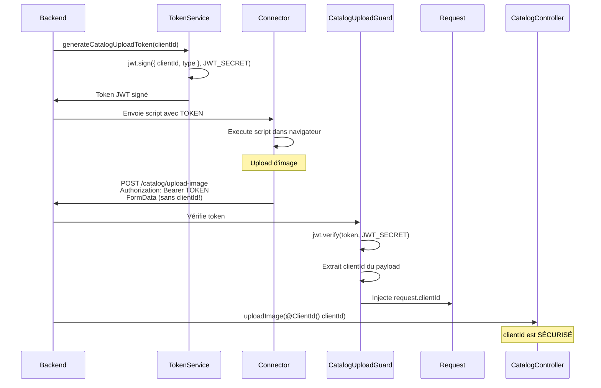

# Sécurité : Tokens JWT avec clientId encodé

## 🔐 Problème de sécurité identifié

### ❌ Approche initiale (non sécurisée)

```typescript
// Script dans le navigateur
formData.append('clientId', CLIENT_ID);  // ❌ DANGEREUX!

// Backend
async uploadImage(@Body('clientId') clientId: string) {
  // Utilise directement le clientId envoyé
}
```

**Vulnérabilité** :

- Un attaquant qui intercepte un token peut spécifier n'importe quel `clientId`
- Il peut uploader des images en se faisant passer pour un autre client
- Usurpation d'identité possible

### ✅ Solution implémentée (sécurisée)

```typescript
// Script dans le navigateur
// clientId n'est PAS envoyé dans le FormData

// Backend
@UseGuards(CatalogUploadGuard)
async uploadImage(@ClientId() clientId: string) {
  // clientId est EXTRAIT du token JWT signé
}
```

**Sécurité** :

- Le `clientId` est encodé dans le token JWT signé
- Le backend vérifie la signature et extrait le `clientId`
- Impossible de modifier le `clientId` sans invalider le token
- Protection contre l'usurpation d'identité

---

## 🏗️ Architecture de sécurité

### Workflow



---

## 📁 Fichiers créés

### 1. TokenService

**Fichier** : `src/common/services/token.service.ts`

```typescript
generateCatalogUploadToken(clientId: string): string {
  const payload = {
    clientId,
    type: 'catalog-upload',
  };

  return jwt.sign(payload, JWT_SECRET, {
    expiresIn: '1h',  // Token expire après 1h
  });
}
```

**Responsabilités** :

- Génère des tokens JWT signés avec `clientId`
- Type de token : `catalog-upload` (pour différencier des autres tokens)
- Expiration : 1 heure

### 2. CatalogUploadGuard

**Fichier** : `src/common/guards/catalog-upload.guard.ts`

```typescript
@Injectable()
export class CatalogUploadGuard implements CanActivate {
  canActivate(context: ExecutionContext): boolean {
    const token = extractTokenFromHeader(request)
    const payload = jwt.verify(token, JWT_SECRET)

    // Vérifie le type
    if (payload.type !== 'catalog-upload') {
      throw new UnauthorizedException()
    }

    // Injecte le clientId dans la requête
    request.clientId = payload.clientId

    return true
  }
}
```

**Responsabilités** :

- Vérifie la signature du token JWT
- Vérifie que le token est de type `catalog-upload`
- Extrait le `clientId` du payload
- Injecte `clientId` dans l'objet `request`

### 3. ClientId Decorator

**Fichier** : `src/common/decorators/client-id.decorator.ts`

```typescript
export const ClientId = createParamDecorator((data: unknown, ctx: ExecutionContext): string => {
  const request = ctx.switchToHttp().getRequest()
  return request.clientId // Injecté par le guard
})
```

**Usage** :

```typescript
@Post('upload-image')
@UseGuards(CatalogUploadGuard)
async uploadImage(@ClientId() clientId: string) {
  // clientId est garanti d'être authentique
}
```

---

## 🔒 Flux de sécurité détaillé

### Étape 1 : Génération du token (Backend)

```typescript
// webhooks.controller.ts
const clientId = '237697020290@c.us'
const token = this.tokenService.generateCatalogUploadToken(clientId)

// Token généré :
// eyJhbGciOiJIUzI1NiIsInR5cCI6IkpXVCJ9.eyJjbGllbnRJZCI6IjIzNzY5NzAyMDI5MEBjLnVzIiwidHlwZSI6ImNhdGFsb2ctdXBsb2FkIiwiaWF0IjoxNzAwMDAwMDAwLCJleHAiOjE3MDAwMDM2MDB9.SIGNATURE
```

**Payload décodé** :

```json
{
  "clientId": "237697020290@c.us",
  "type": "catalog-upload",
  "iat": 1700000000,
  "exp": 1700003600
}
```

### Étape 2 : Exécution du script (Connector)

```javascript
// getCatalog.ts
const TOKEN = 'eyJhbGciOiJIUzI1NiIsInR5cCI6IkpXVCJ9...'

await fetch(`${BACKEND_URL}/catalog/upload-image`, {
  method: 'POST',
  headers: {
    Authorization: `Bearer ${TOKEN}`, // ✅ Token dans header
  },
  body: formData, // ❌ PAS de clientId dans le body
})
```

### Étape 3 : Vérification (Backend)

```typescript
// 1. CatalogUploadGuard s'exécute
@UseGuards(CatalogUploadGuard)

// 2. Le guard vérifie le token
const payload = jwt.verify(token, JWT_SECRET);
// → Échec si token invalide, expiré, ou signature incorrecte

// 3. Le guard extrait le clientId
request.clientId = payload.clientId;
// → '237697020290@c.us'

// 4. Le decorator récupère le clientId
@ClientId() clientId: string
// → '237697020290@c.us' (sécurisé!)
```

---

## 🛡️ Protections implémentées

### 1. Signature cryptographique

- Le token est signé avec `JWT_SECRET`
- Impossible de modifier le payload sans invalider la signature
- Algorithme : HMAC-SHA256

### 2. Type de token

- Chaque token a un `type` spécifique
- Le guard vérifie `type === 'catalog-upload'`
- Empêche l'utilisation de tokens d'autres services

### 3. Expiration

- Tokens valides pendant 1 heure seulement
- Réduit la fenêtre d'attaque en cas de fuite
- `exp` vérifié automatiquement par `jwt.verify()`

### 4. Pas de clientId dans le body

- Le script n'envoie JAMAIS le `clientId` en clair
- Impossible pour un attaquant de le modifier
- Source unique de vérité : le token signé

---

## ⚠️ Cas d'attaque bloqués

### Attaque 1 : Token volé + clientId modifié

**Tentative** :

```javascript
// Attaquant intercepte le token
const TOKEN = 'eyJhbGciOiJIUzI1NiIsInR5cCI6IkpXVCJ9...'

// Attaquant essaie de se faire passer pour un autre client
formData.append('clientId', 'AUTRE_CLIENT@c.us') // ❌ IGNORÉ

fetch('/catalog/upload-image', {
  headers: { Authorization: `Bearer ${TOKEN}` },
  body: formData,
})
```

**Résultat** : ✅ **Bloqué**

- Le backend n'utilise PAS le `clientId` du FormData
- Il extrait le `clientId` du token : `237697020290@c.us`
- L'attaquant ne peut pas changer d'identité

### Attaque 2 : Token modifié

**Tentative** :

```javascript
// Attaquant décode le token et modifie le clientId
const payload = {
  clientId: 'AUTRE_CLIENT@c.us', // ❌ Modifié
  type: 'catalog-upload',
}

const fakeToken = jwt.sign(payload, 'WRONG_SECRET')
```

**Résultat** : ✅ **Bloqué**

- `jwt.verify()` échoue car la signature est invalide
- `UnauthorizedException` lancée
- Impossible de créer un token valide sans `JWT_SECRET`

### Attaque 3 : Token expiré

**Tentative** :

```javascript
// Attaquant utilise un token qui a expiré (> 1h)
const oldToken = 'eyJhbGciOiJIUzI1NiIsInR5cCI6IkpXVCJ9...'
```

**Résultat** : ✅ **Bloqué**

- `jwt.verify()` vérifie automatiquement `exp`
- `TokenExpiredError` lancée
- Obligation de demander un nouveau token

---

## 🧪 Tests de sécurité

### Test 1 : Token valide

```bash
curl -X POST http://localhost:3000/catalog/upload-image \
  -H "Authorization: Bearer VALID_TOKEN" \
  -F "image=@test.jpg" \
  -F "productId=123" \
  -F "collectionId=456"

# ✅ 200 OK - Image uploadée pour le bon clientId
```

### Test 2 : Token invalide

```bash
curl -X POST http://localhost:3000/catalog/upload-image \
  -H "Authorization: Bearer INVALID_TOKEN" \
  -F "image=@test.jpg"

# ❌ 401 Unauthorized - "Invalid token"
```

### Test 3 : Sans token

```bash
curl -X POST http://localhost:3000/catalog/upload-image \
  -F "image=@test.jpg"

# ❌ 401 Unauthorized - "Missing or invalid token"
```

### Test 4 : Token expiré

```bash
curl -X POST http://localhost:3000/catalog/upload-image \
  -H "Authorization: Bearer EXPIRED_TOKEN" \
  -F "image=@test.jpg"

# ❌ 401 Unauthorized - "Token expired"
```

---

## 🔧 Configuration

### Variables d'environnement

```env
# .env (Backend)
JWT_SECRET=your-super-secret-jwt-key-change-in-production
```

**IMPORTANT** :

- `JWT_SECRET` doit être une clé aléatoire forte (>= 32 caractères)
- Ne JAMAIS commit le secret dans git
- Utiliser des secrets différents en dev/staging/prod

### Génération d'un secret fort

```bash
# Node.js
node -e "console.log(require('crypto').randomBytes(32).toString('hex'))"

# OpenSSL
openssl rand -hex 32

# Résultat :
# 8f7d3a9e4b2c1f6d8a5e3c7b9f1d4a6e2c8b5f3a7d9e1c4b6f8a2d5e3c7b9f1d
```

---

## 📊 Comparaison Avant/Après

| Aspect                              | ❌ Avant            | ✅ Après               |
| ----------------------------------- | ------------------- | ---------------------- |
| **clientId dans FormData**          | Oui                 | Non                    |
| **Source de clientId**              | Body (non sécurisé) | Token JWT (signé)      |
| **Vérification**                    | Aucune              | Signature + expiration |
| **Usurpation possible**             | Oui                 | Non                    |
| **Token volé = accès autre client** | Oui                 | Non                    |
| **Durée de vie token**              | Infinie             | 1 heure                |

---

## 🚀 Bonnes pratiques

### ✅ DO

1. **Toujours utiliser JWT_SECRET fort**

   ```typescript
   // ✅ Bon : Secret aléatoire de 32+ caractères
   JWT_SECRET=8f7d3a9e4b2c1f6d8a5e3c7b9f1d4a6e
   ```

2. **Limiter la durée de vie des tokens**

   ```typescript
   // ✅ Bon : Expiration courte
   jwt.sign(payload, secret, { expiresIn: '1h' })
   ```

3. **Vérifier le type de token**

   ```typescript
   // ✅ Bon : Vérifier que c'est le bon type
   if (payload.type !== 'catalog-upload') {
     throw new UnauthorizedException()
   }
   ```

4. **Ne jamais faire confiance au body**

   ```typescript
   // ✅ Bon : Extraire du token
   @ClientId() clientId: string

   // ❌ Mauvais : Utiliser le body
   @Body('clientId') clientId: string
   ```

### ❌ DON'T

1. **Ne jamais commit JWT_SECRET**

   ```bash
   # ❌ Mauvais
   git add .env

   # ✅ Bon
   .env dans .gitignore
   ```

2. **Ne pas utiliser de secrets faibles**

   ```typescript
   // ❌ Mauvais
   JWT_SECRET=secret123

   // ✅ Bon
   JWT_SECRET=8f7d3a9e4b2c1f6d8a5e3c7b9f1d4a6e
   ```

3. **Ne pas désactiver la vérification**

   ```typescript
   // ❌ Mauvais
   jwt.verify(token, secret, { ignoreExpiration: true })

   // ✅ Bon
   jwt.verify(token, secret)
   ```

---

## 📚 Ressources

- **JWT.io** : https://jwt.io/ (déboguer vos tokens)
- **jsonwebtoken** : https://github.com/auth0/node-jsonwebtoken
- **OWASP JWT Cheat Sheet** :
  https://cheatsheetseries.owasp.org/cheatsheets/JSON_Web_Token_for_Java_Cheat_Sheet.html

---

## ✅ Checklist de sécurité

- [x] Token JWT signé avec HMAC-SHA256
- [x] `clientId` encodé dans le payload du token
- [x] Guard qui vérifie la signature du token
- [x] Vérification du type de token (`catalog-upload`)
- [x] Expiration du token (1 heure)
- [x] `clientId` extrait du token, jamais du body
- [x] Decorator `@ClientId()` pour injecter le clientId sécurisé
- [x] `JWT_SECRET` configuré dans `.env`
- [x] Documentation de la sécurité
- [x] Tests de non-régression

---

**Conclusion** : Le système de tokens JWT avec `clientId` encodé garantit qu'un attaquant ne peut
**jamais** usurper l'identité d'un autre client, même s'il intercepte un token valide. 🔐
